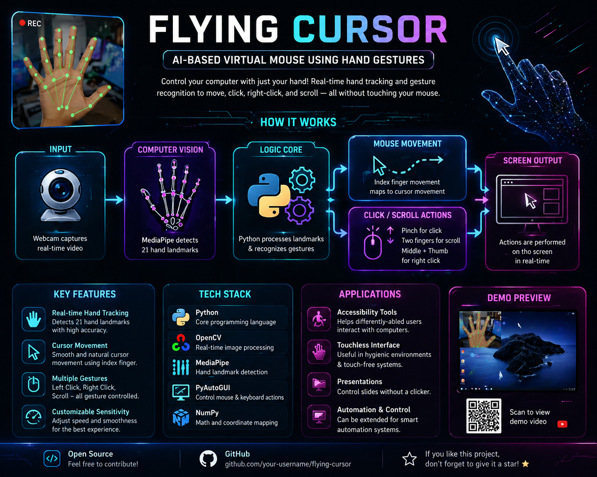

<div align="center">
  <h1>✨🖱️ Flying Cursor: AI-Powered Virtual Mouse 🖱️✨</h1>
  <p><i>Transform your standard webcam into a magical, contactless input device!</i> 🪄</p>
  <p><b>Developer:</b> Ankita Khetre | <b>Version:</b> 2.0 (Gestures & GUI) </p>
</div>

---

## 🚀 What is it?
The **Flying Cursor** is a cutting-edge software that lets you control your computer without ever touching a physical mouse! By leveraging lightning-fast Computer Vision, it tracks your hand in real-time and maps your natural movements straight to your screen. It’s built to be accessible, low-cost, and a total showcase of modern AI on consumer hardware!

## ⚡ Mind-Blowing Features
*   🖐️ **Jedi-Level Control:** Move your cursor with just your index finger[cite: 2].
*   🤏 **Pinch-to-Click:** Execute left clicks instantly using a natural pinching motion[cite: 2].
*   ✌️ **Advanced Gestures:** Raise your middle finger for a Right-Click, or use two fingers to Scroll seamlessly[cite: 2].
*   🧈 **Buttery Smooth:** Powered by Custom Exponential Smoothing algorithms, saying goodbye to jitter and shaky hands forever[cite: 2]!
*   🧠 **CPU Optimized:** Runs flawlessly without a dedicated GPU, all thanks to Google's MediaPipe framework[cite: 2].

## 🛠️ The Tech Stack
*   **Computer Vision:** `OpenCV` (Real-time frame processing)[cite: 2]
*   **Machine Learning:** `MediaPipe` (3D Hand Landmark detection)[cite: 2]
*   **Automation:** `PyAutoGUI` (System-level cursor control)[cite: 2]
*   **Math Engine:** Linear Interpolation & Euclidean Distance mapping[cite: 2]

## 💻 Quick Start Guide
Ready to control your screen like magic? Make sure you have **Python 3.8+** installed[cite: 2]! 



```bash
# 1. Clone the magic
git clone [https://github.com/yourusername/flying-cursor.git](https://github.com/yourusername/flying-cursor.git)
cd flying-cursor

# 2. Install dependencies (Note: MediaPipe is pinned to 0.10.9 for stability!)
pip install opencv-python mediapipe==0.10.9 pyautogui numpy

# 3. Launch the virtual mouse
python main.py


